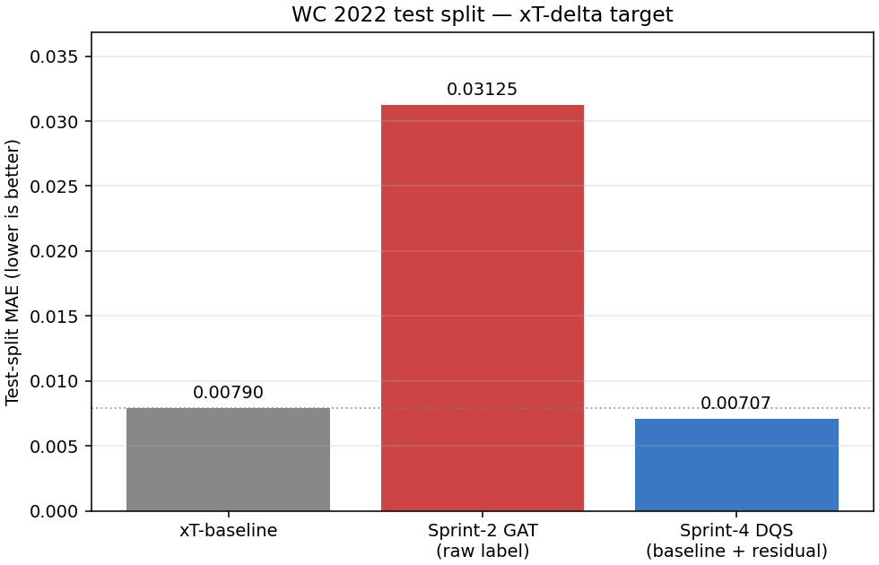

<div align="center">

# xPass++

### Graf Sinir Ağı ile Futbolda Karar Kalitesi Tahmini

[](https://python.org)
[](https://pytorch.org)
[](https://pyg.org)
[](LICENSE)
[](https://mustafaaolmez.github.io/xpass-gnn/)

<br>

**Klasik istatistikler "pas başarılı mı?" sorusunu yanıtlar.**  
**xPass++ ise "bu karar ne kadar kaliteliydi?" sorusunu yanıtlar.**

<br>

🌐 **[Web Arayüzü](https://mustafaaolmez.github.io/xpass-gnn/)** &nbsp;|&nbsp; 📄 **[Rapor (PDF)](./gnn_xpass_rapor.pdf)** &nbsp;|&nbsp; 📊 **[LaTeX Kaynak](./gnn_xpass_rapor.tex)**

</div>

---

## Ne Yapar?

Futbolda bir oyuncu pas verirken veya şut atarken sahadaki tüm oyuncular bir **graf** olarak modellenir. **Graf Dikkat Ağı (GAT)**, bu grafa bakarak o anki kararın ne kadar kaliteli olduğunu 0–1 arası bir skor olan **Decision Quality Score (DQS)** ile ölçer.

```
DQS(eylem) = xT_kapalı_form(konum) + r̂_GAT(graf_bağlamı)
```

> xT skoru yorumlanabilirliği korurken GAT artık tahmini bağlamsal iyileştirmeyi sağlar.

---

## Temel Sonuçlar

<div align="center">

| Model | MAE ↓ | MSE ↓ | Spearman ρ |
|:------|------:|------:|-----------:|
| xT-Temeli (Baseline) | 0.00790 | 0.000172 | 0.746 |
| Sprint-2 GAT | 0.00750 | 0.000145 | 0.738 |
| **xPass++ DQS** ✦ | **0.00707** | **0.000116** | 0.731 |
| **Δ (Baseline → xPass++)** | **−%10.5** | **−%32.6** | −0.015 |

*Test kümesi: n = 7.394 eylem*

</div>



---

## Model Mimarisi

```
Girdi (16 öznitelik)
      │
  ┌───▼────────────────────────────────────────┐
  │  GAT Katman 1 — 4 kafa × 128 boyut         │
  │  GAT Katman 2 — 4 kafa × 128 boyut         │
  │  GAT Katman 3 — 1 kafa × 128 boyut         │
  └───────────────────────────────┬────────────┘
                                  │  ELU + Dropout(0.3)
                             ┌────▼─────┐
                             │ DQS Head │  Linear(128 → 1)
                             └────┬─────┘
                                  │
                             DQS ∈ [0, 1]
```

<div align="center">

| Bileşen | Değer |
|:--------|------:|
| Mimari | Graph Attention Network |
| Katman Sayısı | 3 |
| Dikkat Kafası | 4 (çok başlıklı) |
| Gizli Boyut | 128 |
| **Toplam Parametre** | **~211.000** |
| Aktivasyon | ELU |
| Dropout | 0.3 |
| Optimizer | AdamW |
| Öğrenme Hızı | 1e-3 |
| Erken Durdurma | Sabır = 15 |

</div>

---

## Veri Kümesi

<div align="center">

| Özellik | Değer |
|:--------|------:|
| Kaynak | StatsBomb Open Data |
| Turnuva | FIFA 2022 Dünya Kupası |
| Maç Sayısı | 64 |
| **Toplam Graf** | **73.946** |
| Eylem Türleri | Pas + Şut |
| Düğüm Öznitelik Boyutu | 16 |
| Kenar Öznitelik Boyutu | 8 |
| Train / Val / Test | %70 / %15 / %15 |

</div>

Her eylem için bir graf `G = (V, E)` oluşturulur:
- **Düğümler (V):** Sahadaki tüm görünür oyuncular (~17–22 oyuncu)
- **Kenarlar (E):** 10m mesafe eşiği içindeki oyuncu çiftleri
- **Hedef:** xT-delta (`Δ xT = xT_sonra − xT_önce`)

---

## Kurulum ve Çalıştırma

```bash
# 1. Ortam kur
python -m venv .venv && .venv\Scripts\activate   # Windows
# python -m venv .venv && source .venv/bin/activate  # Linux/Mac

# 2. PyTorch kur (CUDA 12.6)
pip install --index-url https://download.pytorch.org/whl/cu126 torch==2.11.0

# 3. Gereksinimleri kur
pip install -r requirements.txt

# 4. Ortamı doğrula
python scripts/verify_env.py

# 5. Veriyi indir (~865 MB)
python scripts/download_data.py

# 6. Etiketleri üret
python scripts/produce_labels.py

# 7. Modeli eğit (~7 dk, RTX 4050)
python -m src.train_residual

# 8. Değerlendir
python -m src.eval_residual

# 9. Saha ısı haritası oluştur
python notebooks/demo_dqs.py

# 10. Testleri çalıştır
pytest tests/
```

---

## Kısıtlamalar

- **Veri kapsamı:** Yalnızca FIFA 2022 WC verisi — lig maçlarına genelleme test edilmemiştir.
- **Statik graf:** Anlık pozisyon kullanılır; oyuncu hareketleri dinamik olarak modellenmez.
- **Freeze-frame eksikliği:** Bazı maçlarda 360° kare eksiktir; bu eylemler çıkarılmıştır.
- **Spearman ρ:** MAE/MSE iyileşirken ρ hafif düşer — model sıralama yerine mutlak hata minimizasyonuna odaklanır.
- **Eylem türü:** Yalnızca pas ve şut — top sürme, müdahale vb. kapsam dışıdır.

---

## Repo Yapısı

```
xpass-gnn/
├── src/                    # Veri hattı, GAT modeli, eğitim, değerlendirme
├── scripts/                # verify_env, download_data, produce_labels, make_figures
├── notebooks/              # demo_dqs.py — saha ısı haritası
├── tests/                  # pytest (18+ test)
├── docs/figures/           # Sonuç görselleri
├── models/xpass_gnn/       # Eğitilmiş model ağırlıkları
├── data/                   # Ham + işlenmiş veri (gitignored)
├── index.html              # Web arayüzü (GitHub Pages)
├── gnn_xpass_rapor.pdf     # Proje raporu
└── requirements.txt
```

---

<div align="center">

**Mustafa Necati ÖLMEZ** · `230212030`  
Yapay Zeka Mühendisliği · OSTİM Teknik Üniversitesi  
Derin Öğrenme Final Projesi · Danışman: Dr. Murat ŞİMŞEK

</div>
